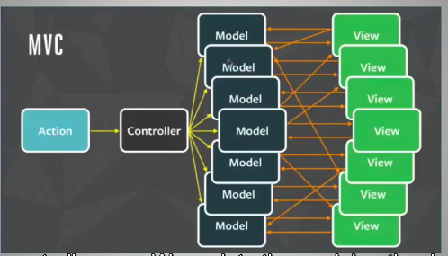
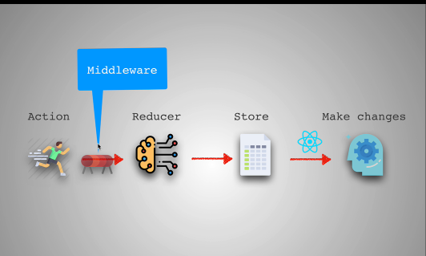

# Permomance


there are three place work needs to happen when u visit a a web


- improve frontend
- improve how stuff are be transfer(network latency)
- improve processing done on the backend

note : senior engineer fine a way to solve they problem in the most effficent way

**Structural way to improve code***


## Network performance Image optimizer

- [jpeg optimizer](https://jpeg-optimizer.com/)  
- [Tiny PNG](https://tinypng.com/)

- working with image guide


- This web below can be us to optimize email just upload image and the give u link for optimize link
[optimize image](https://www.imgix.com/)

- View and remove Exif online: remove meta tags of pictures

[View and remove Exif online](https://www.verexif.com/en/)

reduce number of request

- Cretical Render Path


- you must allow html and css to load first before allow js

- css is call render blocking because in order to construct the rendered tree css dom has to complete ..
note: css is render blocking..


```bash
# writing to load css after 
$ <script type="text/javascript">
$   const loadStyleSheet = src => {
$      if(document.createStyleSheet){
$         document.createStyleSheet(src) 
$    } else {
$      const stylesheet = document.createElement('link');
$      stylesheet.href = src;
$       stylesheet.type = 'text/css';
$       stylesheet.rel = 'stylesheet'
$       document.getElementsByTagName('head')[0].appendchild(stylesheet)
$   }
$  }

$   window.onload = function() {
     console.log('window done')
$   loadStyleSheet('./styles3.css')
$  }
$ <script>

```

testing site

- [webpage tester](https://www.webpagetest.org/)
- [pagesped](https://pagespeed.web.dev/?utm_source=psi&utm_medium=redirect)

- [media quries](https://css-tricks.com/snippets/css/media-queries-for-standard-devices/)

- [Script Tag - async & defer](https://stackoverflow.com/questions/10808109/script-tag-async-defer)

## REdux

- 
- redux reducers


redux help in optimizing complexity in mvc structures


[view more on redux site](https://redux.js.org/introduction/getting-started)

```bash
# add redux to your project
$ yarn add redux

# link redux to react
$ yarn add react-redux

# monitoring stuff
$ yarn add redux-logger

# redux-thunk for handling asynchronous
$ yarn redux-thunk
```

[see more inatallation guide](https://redux.js.org/introduction/installation)


the midddle ware


reactdevtool and reduxdevtool

[Deployment](https://create-react-app.dev/docs/deployment/#github-pages-https-pagesgithubcom)

Important site  
[React Router](https://reactrouter.com/en/main)

- Utility library
[Ramda](https://ramdajs.com/)
[loadash](https://lodash.com/)
[glamorous rock](https://glamorous.rocks/)
[styled-component](https://styled-components.com/)
[css-modules](https://github.com/css-modules/css-modules)
[css modules-react](https://create-react-app.dev/docs/adding-a-css-modules-stylesheet/)
[Gatsby](https://www.gatsbyjs.com/)
[NextJs](https://nextjs.org/)
[material ui](https://mui.com/)
[redux reselect](https://github.com/reduxjs/reselect)
[Redux saga](https://redux-saga.js.org/)
[immutable](https://immutable-js.com/)

- autometed optimization bundler
[parcel](https://parceljs.org/) - for single project
[webpack](https://webpack.js.org/) - for large project
[rollup.js](https://rollupjs.org/) - when creating npm package
